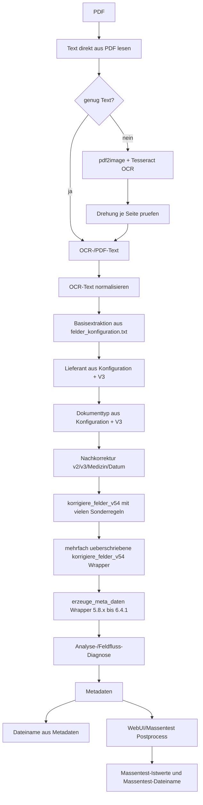
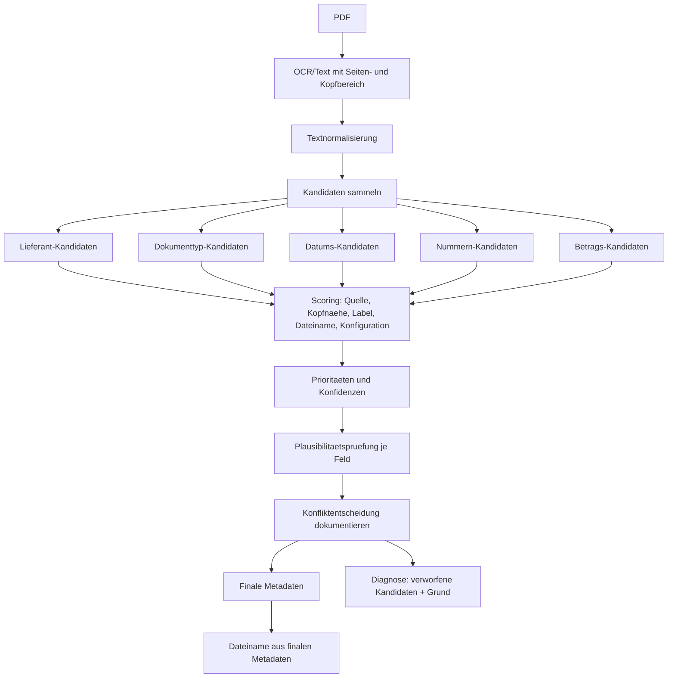

# Sprint 3A - Architektur der Erkennung

Stand: WebUI 4.0.0-alpha / Scan-Service 6.4.1 Stabilisierung

## Ziel

Diese Analyse beschreibt, wie die aktuelle Erkennung Entscheidungen bildet und warum erkannte Werte spaeter wieder veraendert, ueberschrieben oder geloescht werden koennen.

Es wurden keine Python-Dateien, keine OCR, keine Extraktionslogik, keine WebUI, keine Scan-Service-Dateien und keine Referenzdaten geaendert.

## Kurzfazit

Die Vermutung bestaetigt sich: Viele Fehler entstehen nicht primaer durch schlechte OCR, sondern durch eine lange Kette von Nachkorrekturen, Wrappern und Schlussregeln. Mehrere Funktionen erkennen zunaechst plausible Werte, spaetere Funktionen setzen dieselben Felder jedoch erneut, leeren sie pauschal oder verschieben fachliche Nummern in andere Felder.

Besonders betroffen:

- Lieferant
- Dokumenttyp
- Rechnungsnummer
- Kundennummer
- Gesamtbetrag
- Neuer Dateiname als Folgefeld aus Datum, Lieferant und Nummer

AKTENZEICHEN ist in WebUI/Massentest vorhanden, aber im Scan-Service noch nicht sauber als regulaeres Service-Metafeld verankert. Aktuelle Aktenzeichen werden teilweise weiterhin als RECHNR gespeichert.

## Aktuelle Pipeline

## Zentrale aktive Dateien

- `_service/ecodms_scan_service.py`
  Aktive produktive Erkennung, OCR, Metadaten, Dateinamensbildung und Wrapper-Stapel.
- `_webservice/ecodms_webui/ecodms_webui.py`
  Testcenter/Massentest ruft den Scan-Service auf, normalisiert Istwerte fuer die WebUI und baut den Massentest-Dateinamen.
- `_config/felder_konfiguration.txt`
  Basisfelder fuer RECHDATUM, RECHNR, KUNDENNR, AUFTRAGNR, BESTELLNR, LIEFERSCHEINNR.
- `_config/lieferanten_konfiguration.txt`
  Lieferanten-Mapping.
- `_config/dokumenttypen_konfiguration.txt`
  Dokumenttyp-Mapping.
- `_config/dateiname_konfiguration.txt`
  Produktive Dateinamenstruktur.

## OCR und Textbasis

Die OCR-Engine ist Tesseract ueber `pytesseract`, mit PDF-Rendering ueber `pdf2image`.

Wichtige Funktionen:

- `_service/ecodms_scan_service.py:620` `lese_pdf_text_direkt()`
- `_service/ecodms_scan_service.py:668` `ocr_bild_mit_automatischer_drehung()`
- `_service/ecodms_scan_service.py:729` `lese_pdf_text_mit_ocr()`
- `_service/ecodms_scan_service.py:756` `lese_text_aus_pdf()`
- `_service/ecodms_scan_service.py:987` `normalisiere_ocr_text()`

Reihenfolge:

1. Direkttext aus PDF wird versucht.
2. Bei zu wenig Text wird OCR gestartet.
3. OCR prueft pro Seite mehrere Rotationen.
4. Der erkannte Text wird als Debugtext gespeichert.
5. Dieser Debugtext wird spaeter von mehreren Wrappern erneut als Fallback gelesen.

Risiko:

Ein spaeter Wrapper kann mit einem alten oder anders benannten Debugtext arbeiten, wenn Massentest-Dateinamen mit Suffixen entstehen. Das wurde zwar mehrfach abgefangen, bleibt aber architektonisch fragil.

## Feldanalyse

### Lieferant

Schreibende Funktionen:

- `_service/ecodms_scan_service.py:1202` `erkenne_lieferant()`
- `_service/ecodms_scan_service.py:2051` `erkenne_lieferant_v3()`
- `_service/ecodms_scan_service.py:2444` `korrigiere_medizin_v531()`
- `_service/ecodms_scan_service.py:2948` `erzeuge_meta_daten()`
- `_service/ecodms_scan_service.py:3807` `korrigiere_felder_v54()`
- viele spaetere `korrigiere_felder_v54()`-Wrapper ab ca. `5275`
- `_service/ecodms_scan_service.py:8679` `_set_580()`
- `_service/ecodms_scan_service.py:9753` `_set_known_593()`
- `_service/ecodms_scan_service.py:10236` `_set_status_5102()`
- `_service/ecodms_scan_service.py:10524` `_apply_generisch_5110()`
- `_service/ecodms_scan_service.py:10629` `_set_lieferant_600()`
- `_service/ecodms_scan_service.py:10808` `_apply_lieferantenoffensive_610()`
- `_service/ecodms_scan_service.py:11231` `_apply_stabilisierung_641()`
- `_webservice/ecodms_webui/ecodms_webui.py:3269` `massentest_postprocess_meta()`

Ueberschreibende Funktionen:

- `korrigiere_felder_v54()` setzt Lieferanten fuer viele konkrete Lieferanten erneut.
- `_apply_erkennungskern_580()` bis `_apply_erkennungskern_583()` priorisieren Dateiname/Kopfbereich gegen Bankverbindungen und Buchungsposten.
- `_apply_vfl_finalfix_584()` setzt VfL final.
- `_apply_restklassifizierung_591()` setzt LVM, Sparkasse oder leert Zugang.
- `_apply_lieferantenentscheidung_593()` setzt viele Restfall-Lieferanten.
- `_apply_generisch_5110()` setzt Lieferant nur bei leerem/unbekanntem Lieferanten.
- `_apply_quality_600()` setzt Lieferant fuer Versicherungen, Behoerden, Kassenbons, Kaufvertrag, Therapie, Handwerk.
- `_apply_lieferantenoffensive_610()` setzt weitere Lieferanten.
- `massentest_postprocess_meta()` setzt im Massentest VfL oder Kontoauszug-Lieferant erneut.

Loeschende Funktionen:

- `_cleanup_bad_values_593()` leert OCR-Muell-Lieferanten.
- `_apply_erkennungskern_580()` bis `_apply_erkennungskern_583()` leeren Satz-/Label-Lieferanten.
- `_verwerfe_label_lieferant_5733()` und `_verwerfe_label_lieferant_5734()`.
- `_clear_satz_lieferant_5735()`.
- `_apply_lieferantenoffensive_610()` leert unplausible Lieferanten wie Satzfragmente.
- `massentest_postprocess_meta()` kann Lieferant normalisieren.

Sonderregeln:

- VfL, Sparda, LVM, Sparkasse, Amtsgericht, Vorwerk, WAZ, Bonprix, AXA, Stadt Bochum, Polizei, Skyline, Maingau, Genius, Handwerksbetrieb Kend, Rossmann, Tintenfass.

Generische Wrapper:

- `_extract_header_supplier_5110()`
- `_apply_generisch_5110()`
- Teile von `_apply_erkennungskern_582()` und `_apply_erkennungskern_583()` zur Kopfbereich-Priorisierung.

Lieferantenspezifische Wrapper:

- `_apply_vfl_finalfix_584()`
- `_apply_restklassifizierung_591()`
- `_apply_lieferantenentscheidung_593()`
- `_apply_quality_600()`
- `_apply_lieferantenoffensive_610()`
- `_apply_stabilisierung_641()`

Langfristig entfallen sollten:

- Doppelte VfL-/Sparkasse-/Sparda-/Amtsgericht-Regeln in mehreren Wrappern.
- Lieferantenspezifische Einzelkorrekturen, sobald ein Kandidatenmodell Kopfbereich, Dateiname, Briefkopf und Bankverbindung sauber gewichtet.

### Dokumenttyp

Schreibende Funktionen:

- `_service/ecodms_scan_service.py:1229` `erkenne_dokumenttyp()`
- `_service/ecodms_scan_service.py:2098` `erkenne_dokumenttyp_v3()`
- `_service/ecodms_scan_service.py:2444` `korrigiere_medizin_v531()`
- `_service/ecodms_scan_service.py:2948` `erzeuge_meta_daten()`
- `_service/ecodms_scan_service.py:3491` `erkenne_dokumenttyp_zusatz_v56()`
- `_service/ecodms_scan_service.py:3759` `erkenne_dokumenttyp_v54()`
- viele `korrigiere_felder_v54()`-Wrapper
- `_service/ecodms_scan_service.py:10892` `_apply_dokumenttypoffensive_620()`
- `_webservice/ecodms_webui/ecodms_webui.py:3269` `massentest_postprocess_meta()`

Ueberschreibende Funktionen:

- `erkenne_dokumenttyp_v54()` priorisiert Nicht-Rechnungsklassen, laesst Rechnung aber sehr stark gewinnen.
- `korrigiere_felder_v54()` setzt bei vielen Mustern wieder `Rechnung`.
- `_apply_erkennungskern_580()` bis `_apply_erkennungskern_583()` setzen Typen fuer Bank, Behoerde, VfL, WAZ, Vorwerk.
- `_apply_restklassifizierung_591()` setzt Informationsschreiben/Kontoauszug.
- `_apply_lieferantenentscheidung_593()` setzt Restfalltypen.
- `_apply_dokumenttypoffensive_620()` setzt Bescheid, Ermittlungsverfahren, Information, Angebot.

Loeschende Funktionen:

Direktes Leeren ist seltener als beim Lieferanten. Haeufiger wird ein unpassender Typ ersetzt, z. B. `Rechnung` zu `Informationsschreiben`, `Behoerde`, `Kontoauszug` oder `Versicherung`.

Sonderregeln:

- Rechnung gewinnt an mehreren Stellen bei Worttreffern.
- Nicht-Rechnungsklassen: Behoerde, Versicherung, Kuendigung, Reisebestaetigung, Lieferschein, Kassenbon, Rezept, Bescheinigung, Information, Angebot.
- Spaetere Spezialtypen: Ermittlungsverfahren, Hundesteuerbescheid, Zaehlerstandserfassung, Kaufvertrag, Datenschutz-Informationsschreiben.

Generische Wrapper:

- `erkenne_dokumenttyp_v54()`
- `_apply_dokumenttypoffensive_620()`, aber mit konkreten Dokumentklassen.

Lieferantenspezifische Wrapper:

- Fast alle Schlusswrapper ab 5.8.0 enthalten Typregeln fuer konkrete Lieferanten oder Dokumentfamilien.

Langfristig entfallen sollten:

- Wiederholte harte Rechnung-Fallbacks.
- Typentscheidungen, die ohne Konfidenz spaeter echte Nicht-Rechnungen ueberschreiben.

### Dokumentdatum

Schreibende Funktionen:

- `_service/ecodms_scan_service.py:847` `normalisiere_datum()`
- `_service/ecodms_scan_service.py:1713` `nachkorrektur_meta_daten_v2()`
- `_service/ecodms_scan_service.py:2200` `korrigiere_felder_v3()`
- `_service/ecodms_scan_service.py:2371` `korrigiere_datum_v531()`
- `_service/ecodms_scan_service.py:3807` `korrigiere_felder_v54()`
- `_service/ecodms_scan_service.py:9783` `_set_date_if_better_593()`
- `_service/ecodms_scan_service.py:10261` `_set_date_5102()`
- `_service/ecodms_scan_service.py:11231` `_apply_stabilisierung_641()`
- `_webservice/ecodms_webui/ecodms_webui.py:3356` `massentest_reprocess_row()`
- `_webservice/ecodms_webui/ecodms_webui.py:3445` `massentest_process_pdf()`

Ueberschreibende Funktionen:

- `korrigiere_datum_v531()` setzt starkes Labeldatum, Kopfdatum oder allgemeines Datum.
- `korrigiere_felder_v54()` setzt Datum je nach Lieferant/Dokumenttyp erneut.
- `_set_date_if_better_593()` und `_set_date_5102()` setzen Datum aus Dateiname oder Restfalllogik.
- Massentest uebernimmt nur `RECHDATUM` als `dokumentdatum`.

Loeschende Funktionen:

- `_cleanup_bad_values_593()` leert unplausible Daten.
- `_clear_invoice_fields_for_non_invoice()` kann `RECHDATUM` leeren.
- `_clear_for_neutral_doc_v5711()` kann Datum leeren.

Sonderregeln:

- Datum aus Dateiname bei LVM/Sparkasse/Bonprix/Stadt Bochum/Restfaellen.
- Kopfdatum fuer Briefe/Behoerden.
- Rechnungsdatum fuer Rechnungen.

Langfristiges Risiko:

`RECHDATUM`, `DOKUMENTDATUM`, `DATUM` und Dateinamensdatum sind nicht als ein gemeinsames Feldmodell geklaert.

### Rechnungsnummer

Schreibende Funktionen:

- `_service/ecodms_scan_service.py:1713` `nachkorrektur_meta_daten_v2()`
- `_service/ecodms_scan_service.py:2200` `korrigiere_felder_v3()`
- `_service/ecodms_scan_service.py:3807` `korrigiere_felder_v54()`
- viele spaetere `korrigiere_felder_v54()`-Wrapper
- `_service/ecodms_scan_service.py:10524` `_apply_generisch_5110()`
- `_service/ecodms_scan_service.py:10688` `_apply_behoerde_600()`
- `_service/ecodms_scan_service.py:10993` `_apply_betraege_nummern_630()`

Ueberschreibende Funktionen:

- `korrigiere_felder_v54()` extrahiert Label-Wert und setzt leere Werte, wenn kein valider Treffer bleibt.
- Viele Lieferantenbloecke setzen RECHNR aus festen Mustern.
- `_apply_lieferantenentscheidung_593()` setzt RECHNR fuer Tierarzt, Stadt, Polizei usw.
- `_apply_generisch_5110()` setzt Bescheid-/Kassenzeichen als RECHNR.
- `_apply_betraege_nummern_630()` setzt Staatsanwaltschaft-Aktenzeichen als RECHNR.

Loeschende Funktionen:

- `korrigiere_felder_v54()` leert RECHNR bei Behoerden, Informationen, Versicherungen, Bescheinigungen, Formularen.
- `_clear_nummern_580()`
- `_clear_bank_invoice_fields_591()`
- `_clear_invoice_numbers_593()`
- `_apply_restfaelle_5102()` leert RECHNR bei Bestellbestaetigungen und Nicht-Rechnungen.

Sonderregeln:

- Bonprix, Amazon, Telekom, BORA, ALLPAX, Vorwerk, AfB, Skyline, Moritz Fiege, Staatsanwaltschaft, Stadt Bochum.

Hauptproblem:

RECHNR ist ein Sammelfeld fuer Rechnungsnummer, Bescheidnummer, Kassenzeichen und Aktenzeichen. Dadurch entstehen Folgefehler im Dateinamen.

### Kundennummer

Schreibende Funktionen:

- `_service/ecodms_scan_service.py:1713` `nachkorrektur_meta_daten_v2()`
- `_service/ecodms_scan_service.py:2200` `korrigiere_felder_v3()`
- `_service/ecodms_scan_service.py:3807` `korrigiere_felder_v54()`
- viele spaetere `korrigiere_felder_v54()`-Wrapper
- `_service/ecodms_scan_service.py:10281` `_apply_restfaelle_5102()`
- `_service/ecodms_scan_service.py:11231` `_apply_stabilisierung_641()`

Ueberschreibende Funktionen:

- `korrigiere_felder_v54()` setzt KUNDENNR aus Label-Wert-Bloecken.
- Vorwerk-, Telekom-, BORA-, ALLPAX-, Bonprix- und Behoerdenregeln setzen oder leeren Kundennummern.
- Erkennungskern 5.8.x leert Kundennummern bei Bank-/VfL-/Behoerdenkontexten.

Loeschende Funktionen:

- `korrigiere_felder_v54()` leert KUNDENNR in vielen Nicht-Kunden-Kontexten.
- `_apply_erkennungskern_580()` bis `_apply_erkennungskern_583()` leeren BLZ/Konto-/Bankfragmente.
- `_clear_invoice_numbers_593()`.
- `_apply_restfaelle_5102()` leert bei Genius/Stadt Bochum.

Sonderregeln:

- Bonprix-Kunden-Nr.
- Telekom Kundennummer.
- Vorwerk Kundennummer.
- Amtsgericht/Behoerden: Kassenzeichen teils Kundennummer, teils RECHNR.

Hauptproblem:

KUNDENNR wird oft als Schutz gegen falsche Bank-/BLZ-Werte geleert. Ohne Kandidatenliste ist nicht sichtbar, ob ein korrekter Kandidat vorher vorhanden war.

### Aktenzeichen

Aktueller Stand:

- In der WebUI/Massentest ist `AKTENZEICHEN` als Soll-/Ist-Feld vorhanden:
  - `_webservice/ecodms_webui/ecodms_webui.py:2229`
  - `_webservice/ecodms_webui/ecodms_webui.py:3373`
  - `_webservice/ecodms_webui/ecodms_webui.py:3392`
  - `_webservice/ecodms_webui/ecodms_webui.py:3415`
- Im Scan-Service fehlt `AKTENZEICHEN` in `META_FELD_REIHENFOLGE`.
- In `_service/ecodms_scan_service.py:11120` wird AKTENZEICHEN nur als Alias in der Feldflussdiagnose sichtbar gemacht.

Schreibende Funktionen:

- Keine robuste zentrale Service-Funktion schreibt AKTENZEICHEN als regulaeres Metafeld.
- Akten-/Kassenzeichen werden aktuell meist in RECHNR geschrieben:
  - `_apply_betraege_nummern_630()` bei Staatsanwaltschaft.
  - `_apply_generisch_5110()` bei Bescheid-/Kassenzeichen.
  - `_apply_restfaelle_5102()` bei Hundesteuer.

Loeschende Funktionen:

- Da AKTENZEICHEN nicht als Standardfeld gefuehrt wird, kann es indirekt verloren gehen, sobald nur Standardfelder kopiert oder verglichen werden.

Langfristig:

AKTENZEICHEN sollte als echtes Service-Metafeld verankert werden und von RECHNR getrennt bleiben.

### Versicherungsnummer

Schreibende Funktionen:

- `korrigiere_felder_v54()` fuer Hauptzollamt, ADAC, Allianz, Santander, LVM usw.
- `_apply_restklassifizierung_591()` fuer LVM.
- `_apply_lieferantenentscheidung_593()` fuer AXA.

Ueberschreibende Funktionen:

- Versicherungs-/Bank-/Behoerdenwrapper setzen VERSICHERUNGSNR je nach Dokumentfamilie.

Loeschende Funktionen:

- `_bereinige_fachnummern_580()` leert BLZ/Kontoartige Werte.
- `_clear_bad_numbers_5736()`
- `_clear_fachnummern_5735()`
- `_clear_nummern_580()`
- `_apply_restfaelle_5102()`

Sonderregeln:

- LVM, AXA, ADAC, Allianz, Santander, Hauptzollamt.

Risiko:

VERSICHERUNGSNR wird auch zum Auffangen fachfremder Nummern genutzt und spaeter oft pauschal geleert.

### Betrag / Gesamtbetrag

Schreibende Funktionen:

- `_service/ecodms_scan_service.py:2160` `extrahiere_gesamtbetrag()`
- `_service/ecodms_scan_service.py:2200` `korrigiere_felder_v3()`
- `_service/ecodms_scan_service.py:3523` `extrahiere_gesamtbetrag_v56()`
- `_service/ecodms_scan_service.py:3620` `extrahiere_gesamtbetrag_v54()`
- `_service/ecodms_scan_service.py:3807` `korrigiere_felder_v54()`
- `_service/ecodms_scan_service.py:10646` `_extract_amount_600()`
- `_service/ecodms_scan_service.py:10970` `_amount_candidates_630()`
- `_service/ecodms_scan_service.py:11231` `_apply_stabilisierung_641()`

Ueberschreibende Funktionen:

- `korrigiere_felder_v54()` setzt Betrag abhaengig vom Dokumenttyp.
- Lieferantenspezifische Bloecke setzen Betrag erneut.
- `_apply_quality_600()` und `_apply_betraege_nummern_630()` setzen Betrag fuer Kaufvertrag, Kassenbon, Skyline, Moritz Fiege.
- `_apply_stabilisierung_641()` setzt Kaufpreis, Tintenfass-Bon und Vorwerk-Betrag spaet.

Loeschende Funktionen:

- `korrigiere_felder_v54()` leert GESAMTBETRAG bei Information, Behoerde, Bescheinigung, Versicherung, Formular, Kassen-/Nullrechnung.
- `_clear_nummern_580()` kann GESAMTBETRAG mit leeren.
- `_clear_bank_invoice_fields_591()`
- `_clear_invoice_numbers_593(keep_amount=False)`
- `_apply_restfaelle_5102()`
- `massentest_postprocess_meta()` leert Betrag bei Kontoauszug.

Hauptproblem:

Betragserkennung ist stark vom Dokumenttyp abhaengig. Ein falscher Dokumenttyp kann einen korrekt erkannten Betrag loeschen oder einen falschen Betrag erlauben.

### Neuer Dateiname

Schreibende Funktionen:

- Produktiv:
  - `_service/ecodms_scan_service.py:4974` `erstelle_pdf_zielname_v5712()`
  - `_service/ecodms_scan_service.py:5112` Nutzung in `verarbeite_pdf()`
- Massentest:
  - `_webservice/ecodms_webui/ecodms_webui.py:3388` `massentest_build_new_name()`
  - `_webservice/ecodms_webui/ecodms_webui.py:3425` `massentest_aktualisiere_soll_dateiname()`
  - `_webservice/ecodms_webui/ecodms_webui.py:3445` `massentest_process_pdf()`

Ueberschreibende Funktionen:

- Der Dateiname wird nicht direkt von der Erkennung ueberschrieben, sondern jedes Mal aus aktuellen Metadaten neu gebildet.
- Dadurch wirkt jede spaete Aenderung an Datum, Lieferant oder Nummer direkt auf den Dateinamen.

Loeschende Funktionen:

- Kein direktes Leeren. Wenn Datum/Lieferant/Nummer leer oder falsch sind, wird der Dateiname folgerichtig falsch oder generisch.

Sonderregeln:

- Produktiv nutzt `dateiname_konfiguration.txt` mit Schema `{DATUM}_{LIEFERANT}_{NUMMER}`.
- Produktiv nimmt Nummernfolge: RECHNR, VERSICHERUNGSNR, AUFTRAGNR, BESTELLNR, LIEFERSCHEINNR.
- Massentest nimmt Nummernfolge: RECHNR, AKTENZEICHEN, KUNDENNR, AUFTRAGNR, BESTELLNR, LIEFERSCHEINNR, VERSICHERUNGSNR.

Architekturrisiko:

Produktiv- und Massentest-Dateinamenbildung sind nicht identisch. AKTENZEICHEN ist im Massentest priorisiert, produktiv aber nicht im Platzhalterset enthalten.

## Tatsaechliche Reihenfolge der Entscheidungen

Aktuell entsteht effektiv diese Reihenfolge:

1. PDF-Text direkt lesen.
2. OCR-Fallback mit Tesseract.
3. OCR-Qualitaet bewerten.
4. Basisfelder aus `felder_konfiguration.txt` extrahieren.
5. Lieferant aus `lieferanten_konfiguration.txt`.
6. Lieferant V3 bereinigen.
7. Dokumenttyp aus `dokumenttypen_konfiguration.txt`.
8. Dokumenttyp V3 bereinigen.
9. Metadaten-Dict aus `META_FELD_REIHENFOLGE` bauen.
10. `nachkorrektur_meta_daten_v2()`.
11. `korrigiere_felder_v3()`.
12. `korrigiere_medizin_v531()`.
13. `korrigiere_datum_v531()`.
14. `korrigiere_felder_v54()`.
15. Viele spaetere `korrigiere_felder_v54()`-Wrapper.
16. `pruefe_und_lerne_unbekanntes_v551()`.
17. `erzeuge_meta_daten()`-Wrapper 5.8.0.
18. `erzeuge_meta_daten()`-Wrapper 5.8.1.
19. `erzeuge_meta_daten()`-Wrapper 5.8.2.
20. `erzeuge_meta_daten()`-Wrapper 5.8.3.
21. `erzeuge_meta_daten()`-Wrapper 5.8.4.
22. `erzeuge_meta_daten()`-Wrapper 5.9.1.
23. `erzeuge_meta_daten()`-Wrapper 5.9.3.
24. `erzeuge_meta_daten()`-Wrapper 5.9.4 Diagnose.
25. `erzeuge_meta_daten()`-Wrapper 5.10.2.
26. `erzeuge_meta_daten()`-Wrapper 5.11.0.
27. `erzeuge_meta_daten()`-Wrapper 6.0.
28. `erzeuge_meta_daten()`-Wrapper 6.1.
29. `erzeuge_meta_daten()`-Wrapper 6.2.
30. `erzeuge_meta_daten()`-Wrapper 6.3.
31. `erzeuge_meta_daten()`-Wrapper 6.4 Feldfluss.
32. `erzeuge_meta_daten()`-Wrapper 6.4.1 Stabilisierung.
33. Produktiver Dateiname oder Massentest-Dateiname aus dem finalen Meta-Dict.
34. Im Massentest zusaetzlich `massentest_postprocess_meta()` vor Istwertspeicherung.

## Wrapper-Bewertung

### Hilfreich

- 5.9.4 Analyse-Isolation: diagnostisch hilfreich, veraendert fachliche Werte nicht direkt.
- 6.4 Feldfluss-Diagnose: sehr hilfreich, weil Alias- und Feldverluste sichtbar werden.
- 5.11.0 Generikerkennung: prinzipiell hilfreich, weil sie nur bei leerem Lieferanten arbeitet.
- 6.3 Betrag/Nummern: teilweise hilfreich, aber wegen AKTENZEICHEN als RECHNR riskant.

### Riskant

- `korrigiere_felder_v54()` und seine vielen spaeteren Redefinitionen: sehr breit, viele Lieferanteneinzelfaelle, viele Leerungen.
- 5.8.0 bis 5.8.4: mehrfacher Erkennungskern mit ueberlappenden Bank-/VfL-/Amtsgericht-Regeln.
- 5.9.1 und 5.9.3: wichtige Restfallkorrekturen, aber stark dateiname- und lieferantenspezifisch.
- 6.0 bis 6.2: Qualitaets-/Lieferanten-/Dokumenttypoffensive, aber erneut mit direkten finalen Feldsetzungen.
- 6.4.1: gezielte Stabilisierung, aber spaet in der Pipeline und dadurch final ueberschreibend.

### Langfristig entfallen oder aufloesen

- Mehrfach vorhandene Finalfixes fuer dieselben Dokumentfamilien.
- Direkte `meta["..."] = ""`-Loeschungen ohne Begruendung/Konfidenz.
- Einzelne Lieferantenwrapper, sobald dieselbe Entscheidung durch Kandidaten, Prioritaeten und Plausibilitaeten abbildbar ist.
- RECHNR als Sammelfeld fuer Aktenzeichen/Kassenzeichen/Bescheidnummer.

## Hauptursachen fuer Folgefehler

1. Falscher Lieferant fuehrt zu falschem Dokumenttyp und falschem Dateinamen.
2. Falscher Dokumenttyp entscheidet, ob Nummern und Betrag erlaubt oder geloescht werden.
3. Rechnungsnummer wird als Sammelfeld fuer fachlich unterschiedliche Nummern genutzt.
4. Betrag wird bei Nicht-Rechnung oft geloescht, auch wenn Dokumenttyp falsch klassifiziert wurde.
5. Produktiv- und Massentest-Dateiname nutzen unterschiedliche Nummernprioritaeten.
6. AKTENZEICHEN ist kein echtes Service-Feld und kann deshalb nicht sauber priorisiert werden.

## Zielbild fuer eine kuenftige Pipeline

Prinzipien:

- Keine Funktion schreibt sofort final in `meta`.
- Jede Funktion liefert Kandidaten mit Quelle, Kontext und Konfidenz.
- Spaete Regeln duerfen Kandidaten abwerten, aber nicht still Felder loeschen.
- Finale Auswahl passiert einmal.
- Jede Feldentscheidung bleibt nachvollziehbar.

## Zielmodell pro Feld

### Kandidaten

Jeder Kandidat sollte enthalten:

- Feld
- Wert
- Quelle: OCR, Direkttext, Dateiname, Begleitmeta, Konfiguration, Regel
- Kontext: Kopfbereich, Label-Wert, Fliesstext, Fusszeile, Bankverbindung
- Dokumentseite / Zeilennummer, soweit vorhanden
- Regelname
- Konfidenz
- Plausibilitaetsstatus

### Prioritaeten

Beispielhafte Prioritaet:

1. Expliziter Label-Wert im Kopfbereich.
2. Konfigurierter Lieferant im Briefkopf.
3. Starker Dokumenttypmarker.
4. Dateiname als Zusatzhinweis.
5. Fliesstext nur mit niedrigerer Konfidenz.
6. Fusszeile/Bankverbindung nur, wenn Dokumentklasse dazu passt.

### Plausibilitaet

Beispiele:

- Rechnung erlaubt RECHNR und GESAMTBETRAG.
- Kontoauszug erlaubt keinen einzelnen GESAMTBETRAG.
- Behoerde erlaubt AKTENZEICHEN/KASSENZEICHEN, aber nicht automatisch RECHNR.
- Versicherung erlaubt VERSICHERUNGSNR, aber nicht automatisch RECHNR.
- Kassenbon erlaubt Betrag und Datum, oft keine Rechnungsnummer.

### Konfliktentscheidung

Statt stiller Ueberschreibung:

- Kandidat A gewinnt gegen Kandidat B wegen Kopfbereich.
- Kandidat B verworfen wegen Bankverbindung.
- Betrag verworfen wegen Steuer-/MwSt-Kontext.
- Aktenzeichen nicht als RECHNR uebernommen, sondern in AKTENZEICHEN gespeichert.

## Risikoarme Massnahmen fuer Sprint 3B

1. Feldfluss-Auswertung pro Problemfeld nutzen und nicht sofort Logik aendern.
2. AKTENZEICHEN als echtes Service-Metafeld in `META_FELD_REIHENFOLGE` vorbereiten.
3. RECHNR-Clearing entschaerfen: nicht loeschen, sondern mit Grund diagnostizieren.
4. Produktiv- und Massentest-Dateinamenfolge angleichen oder bewusst dokumentieren.
5. Dokumenttyp-Prioritaet fuer Behoerde/Info/Bescheid/Register vor Rechnung pruefen.
6. Label-Wert-Bloecke fuer Bonprix/aehnliche Layouts generisch verbessern.

## Was klar in Beta/LTS gehoert

- Vollstaendiger Kandidatenkernel mit Konfidenzen.
- Seiten-/Layoutanalyse.
- Template-Erkennung.
- UI fuer Feldfluss-Trace je Dokument.
- Historische Trendanalyse ueber mehrere Builds.
- Vollstaendige Abloesung der alten Wrapper durch eine zentrale Entscheidungsmaschine.

## Empfehlung fuer den naechsten Schritt

Sprint 3B sollte nicht mit breiten neuen Regeln starten. Sinnvoller ist:

1. Feldflussdiagnose fuer 5 bis 10 typische Abweichungsdokumente auswerten.
2. Je Feld pruefen, ob ein korrekter Kandidat frueher vorhanden war.
3. Nur dort eingreifen, wo ein spaeter Wrapper nachweislich einen besseren Wert ueberschreibt oder loescht.
4. Danach sofort 128er Regression und Buildvergleich laufen lassen.

Der groesste kurzfristige Nutzen liegt wahrscheinlich nicht in neuer OCR, sondern im Reduzieren spaeter Ueberschreibungen und im Trennen von RECHNR, AKTENZEICHEN, KASSENZEICHEN und VERSICHERUNGSNR.
